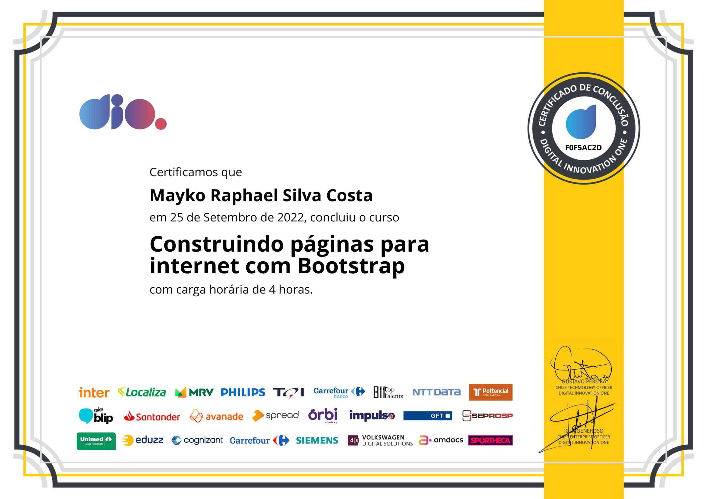

# - 👨‍💻 Alguns dos meus certificados

## Os certificados abaixo demonstram apenas a parte inicial da minha jornada. Acredito que o maior aprendizado vem das experiências reais e dos projetos que estão sendo construídos.

## Danki Code

## DIO

